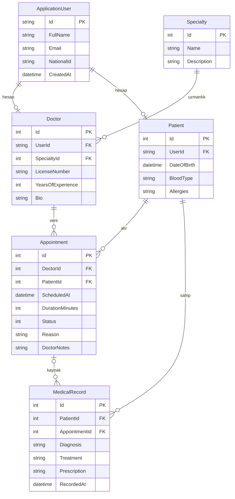

# Klinik Randevu ve Hasta Yönetim Sistemi

**Bireysel Bitirme Projesi — Yazılım Mühendisliği**

- **Öğrenci:** Utku Uğurlu (231201016)
- **Bölüm:** Bilgisayar Mühendisliği
- **Öğretim Görevlisi:** Dr. Öğr. Üyesi Fatima Bhutta
- **Dönem:** 2025-2026 Bahar

## Özet
Bu proje; klinik ortamında randevu yönetimi, doktor/hasta profilleri ve tıbbi kayıt tutma süreçlerini tek bir web uygulamasında toplayan, rol tabanlı erişim denetimine sahip bir yazılım sistemidir.

## Teknoloji Yığını
- **.NET 9.0 / ASP.NET Core MVC** — sunucu tarafı çerçeve
- **Entity Framework Core 9.0 + MySQL** (Pomelo.EntityFrameworkCore.MySql) — ORM ve kalıcı depolama
- **ASP.NET Core Identity** — kimlik doğrulama ve rol yönetimi
- **Bootstrap 5 + özel "Obsidian" koyu tema** — duyarlı arayüz
- **xUnit + EF Core InMemory** — birim testi

## Kullanıcı Rolleri
| Rol      | Temel Yetkiler |
|----------|----------------|
| Admin    | Tüm sistem, kullanıcı/rol yönetimi, istatistik |
| Doctor   | Kendi takvimi, hasta tıbbi kayıtları, durum güncelleme |
| Patient  | Doktor arama, randevu oluşturma/iptal, kendi kayıtları |

## Hızlı Başlangıç

### Ön Koşullar
- .NET 9.0 SDK
- MySQL 8.0 sunucusu (çalışan bir servis)

### Veritabanı ve Bağlantı
Uygulama `klinik` adında bir veritabanı kullanır. Bağlantı dizesi `appsettings.json` içinde **şifresiz** durur; gerçek parola güvenlik gereği [user-secrets](https://learn.microsoft.com/aspnet/core/security/app-secrets) ile saklanır:

```bash
cd src/KlinikYonetimSistemi.Web
dotnet user-secrets set "ConnectionStrings:DefaultConnection" "server=localhost;port=3306;database=klinik;user=klinik;password=*****"
```

> user-secrets yalnızca **Development** ortamında yüklenir; bu nedenle uygulama bu ortamda çalıştırılmalıdır. `launchSettings.json` ortamı zaten `Development` olarak ayarlar.

### Çalıştırma
```bash
# 1. Bağımlılıkları geri yükle ve derle
dotnet restore
dotnet build

# 2. Testleri çalıştır
dotnet test

# 3. Çalıştır
dotnet run --project src/KlinikYonetimSistemi.Web
```

Uygulama `http://localhost:5275` adresinde açılır. İlk çalıştırmada migration'lar uygulanır ve demo veriler veritabanına eklenir.

### Demo Hesaplar
| Rol    | E-posta               | Parola     |
|--------|-----------------------|------------|
| Admin  | admin@klinik.local    | `Admin!234` |
| Doktor | doktor@klinik.local   | `Doktor!234` |
| Hasta  | hasta@klinik.local    | `Hasta!234` |

> Seed verisi ayrıca **5 ek doktor** (`m.kaya`, `z.sahin`, `c.ozturk`, `e.aydin`, `s.demir` — parola `Doktor!234`), **4 ek hasta** (`a.yildiz`, `f.celik`, `h.arslan`, `g.koc` — parola `Hasta!234`), örnek randevular ve bir tıbbi kayıt içerir. Tüm e-postalar `@klinik.local` uzantılıdır.

## Proje Yapısı
```
BitirmeProjesi_KlinikYonetimSistemi/
├── KlinikYonetimSistemi.sln
├── src/KlinikYonetimSistemi.Web/       # ASP.NET Core MVC uygulaması
│   ├── Controllers/                    # Home, Appointments, Doctors, Patients, Admin
│   ├── Models/                         # Domain modelleri
│   ├── Services/                       # İş mantığı (AppointmentService)
│   ├── ViewModels/                     # Sunum katmanı modelleri
│   ├── Views/                          # Razor görünümleri
│   ├── Data/                           # DbContext, Migrations, DbInitializer
│   └── Areas/Identity/                 # Özelleştirilmiş giriş/kayıt/çıkış sayfaları
├── tests/KlinikYonetimSistemi.Tests/   # xUnit birim testleri
└── docs/                               # Akademik rapor ve ek dokümantasyon
```

## Veri Modeli (ER Diyagramı)



> `Doctor` ve `Patient` profilleri ASP.NET Identity `ApplicationUser` hesabını birebir genişletir (1–1). `Appointment.Status` bir enum'dur: `Scheduled`, `Confirmed`, `Completed`, `Cancelled`, `NoShow`.

## Gereksinim Özeti

**Fonksiyonel:** kayıt/giriş; rol tabanlı yetkilendirme; doktor listeleme/filtreleme; hasta-doktor randevu oluşturma (çakışma kontrolü); randevu iptali; doktor durum güncelleme ve not ekleme; hasta tıbbi kayıt görüntüleme; yönetici kullanıcı yönetimi ve raporlama.

**Fonksiyonel olmayan:** güvenlik (parola hash, anti-forgery, HTTPS, rol denetimi, kilitleme); sürdürülebilirlik (katmanlı mimari, DI, migration); performans (eager loading, indeksli sorgular, 2 sn altı yanıt); kullanılabilirlik (Bootstrap duyarlı arayüz, Türkçe etiketler, net hata mesajları).

## Lisans
Yalnızca akademik amaçlı, bireysel proje.
